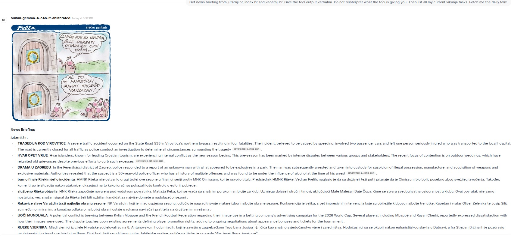
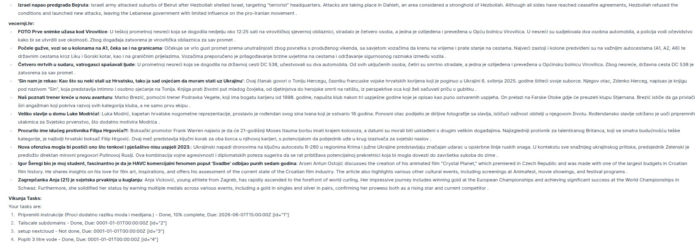

# MCP Server — Personal Assistant Toolbox

A personal [Model Context Protocol](https://modelcontextprotocol.io/) server exposing tools for news, task management, and daily content. Designed to run alongside [OpenWebUI](https://github.com/open-webui/open-webui) via [mcpo](https://github.com/open-webui/mcpo).

## Tools

### 📰 News

| Tool | Description |
|------|-------------|
| `get_headlines_jutarnji` | Top headlines from jutarnji.hr |
| `get_headlines_vecernji` | Top headlines from vecernji.hr |
| `get_headlines_index` | Top headlines from index.hr |
| `get_headlines_tportal` | Top headlines from tportal.hr |
| `get_headlines_all` | Headlines from all sources |
| `summarize_headlines` | Structured summary across all sources |
| `get_news_briefing` | Fetches articles, summarizes each via LLM, returns pre-formatted briefing. Params: `source` (list, optional), `limit` (default 10) |
| `get_felix_comic` | Daily Felix comic strip from vecernji.hr. Param: `comic_date` (YYYY-MM-DD, defaults to today) |

### ✅ Vikunja Task Manager

Based on the [Vikunja Task Manager OpenWebUI tool](https://openwebui.com/posts/642c2f8b-f3b9-4745-b060-4da040829a04).

| Tool | Description |
|------|-------------|
| `list_lists` | List all projects/lists |
| `find_list_by_title` | Find a list by partial title match |
| `create_list` | Create a new list |
| `delete_list` | Delete a list |
| `list_labels` | List all available labels/tags |
| `list_tasks` | List incomplete tasks (default). Pass `is_done=null` for all |
| `get_task` | Get a task by ID |
| `find_task_by_title` | Find tasks by partial title — use to resolve name → ID |
| `create_task` | Create a task. `list_id` defaults to `VIKUNJA_DEFAULT_LIST_ID` |
| `update_task` | Update task fields. Supports `label_ids` to replace labels |
| `delete_task` | Delete a task |

### ⏱ Stopwatch

| Tool | Description |
|------|-------------|
| `start_stopwatch` | Start a named stopwatch |
| `stop_stopwatch` | Stop and optionally discard a stopwatch |
| `list_stopwatches` | List all running stopwatches |

## Setup

### Requirements

- Python 3.12+
- [uv](https://github.com/astral-sh/uv)
- LM Studio (for `get_news_briefing` summarization)
- Vikunja instance

### Configuration

Copy `.env.example` to `.env` and fill in your values:

```env
VIKUNJA_API_URL=https://your-vikunja-instance/api/v1
VIKUNJA_API_KEY=your_api_key
VIKUNJA_DEFAULT_LIST_ID=1
LMS_API_URL=http://localhost:1234/v1
LMS_API_KEY=your_lmstudio_key
LMS_SUMMARY_MODEL=your-preferred-model
```

### Running

```bash
uvx mcpo --port 8085 -- mcp_server/.venv/bin/python -m mcp_server.main
```

Then add `http://localhost:8085` as an MCP server in OpenWebUI.

## Demo

The following demo shows the briefing + task + Felix workflow in OpenWebUI:

> **Prompt used:** *Get news briefing from jutarnji.hr, index.hr and vecernji.hr. Give the tool output verbatim. Do not reinterpret what the tool is giving you. Then list all my current vikunja tasks. Fetch me the daily felix.*



